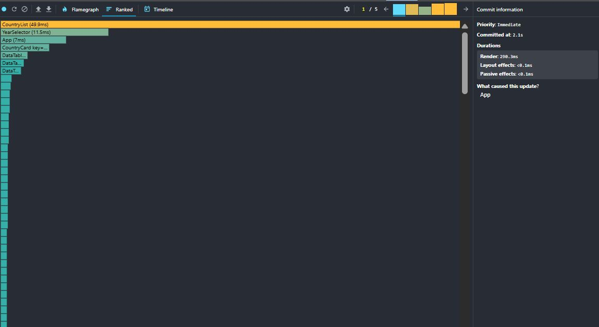
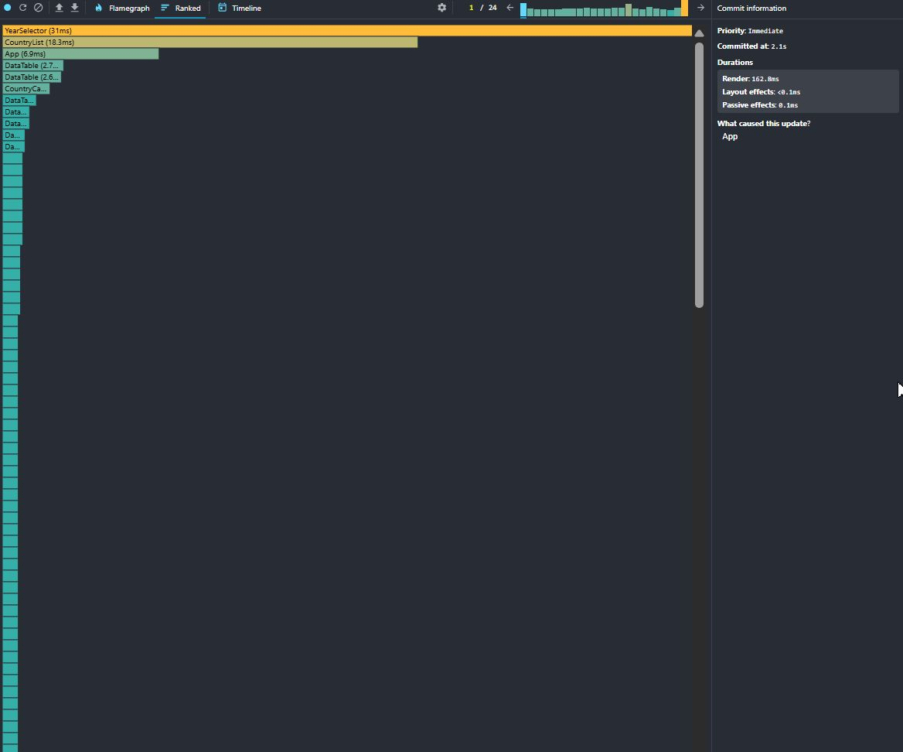
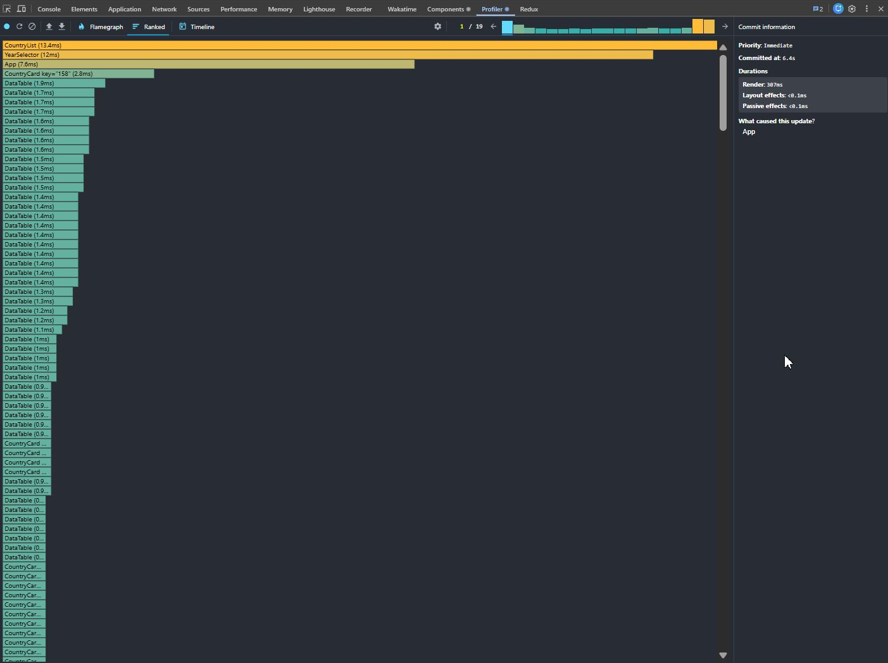
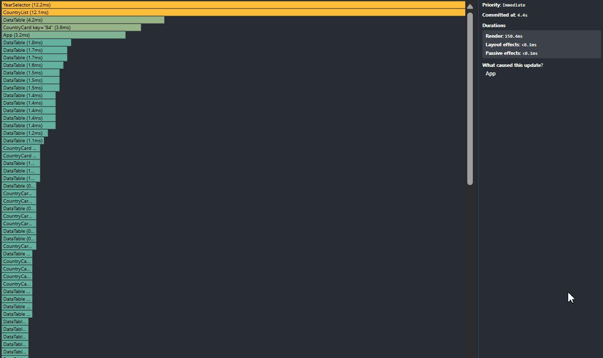
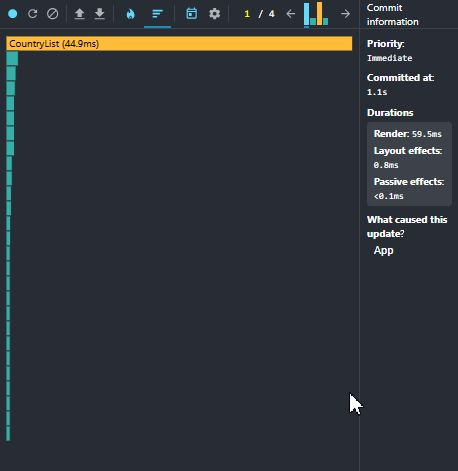
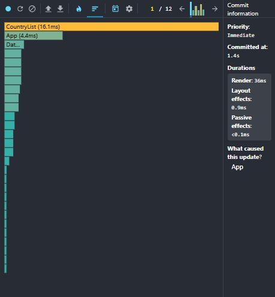
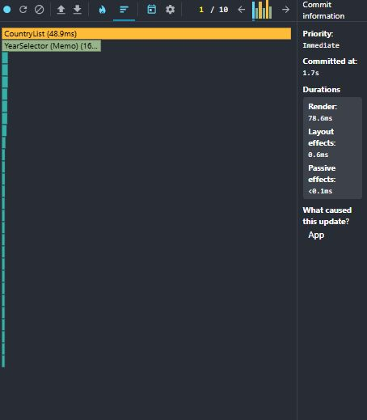
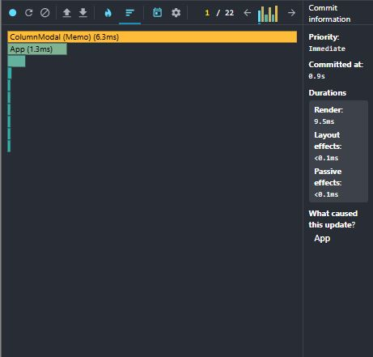

# Performance Optimization Report

## Baseline Measurements

### Interaction A: Sort countries

- **Commit duration**: 2.1 s
- **Render duration**: 290 ms
- **Screenshot**: 

### Interaction B: Search countries

- **Commit duration**: 2.1 s
- **Render duration**: 162 ms
- **Screenshot**: 

### Interaction C: Change year

- **Commit duration**: 6.4 s
- **Render duration**: 307 ms
- **Screenshot**: 

### Interaction D: Toggle column

- **Commit duration**: 4.4 s
- **Render duration**: 150 ms
- **Screenshot**: 

## Optimized Measurements

### Interaction A: Sort countries

- **Commit duration**: 1.1 s
- **Render duration**: 59.5 ms
- **Screenshot**: 

### Interaction B: Search countries

- **Commit duration**: 1.4 s
- **Render duration**: 36 ms
- **Screenshot**: 

### Interaction C: Change year

- **Commit duration**: 1.7 s
- **Render duration**: 78.6 ms
- **Screenshot**: 

### Interaction D: Toggle column

- **Commit duration**: 0.9 s
- **Render duration**: 9.5 ms
- **Screenshot**: 

## Summary of Improvements

| Interaction      | Baseline (ms) | Optimized (ms) | Improvement |
| ---------------- | ------------- | -------------- | ----------- |
| Sort countries   | 290           | 59.5           | 79%         |
| Search countries | 162           | 36             | 78%         |
| Change year      | 307           | 78.6           | 74%         |
| Toggle column    | 150           | 9.5            | 94%         |
| **Average**      | **227**       | **46**         | **80%**     |

## Applied Optimizations

- `useMemo` for `years`, `availableColumns`, `filteredCountries`, `yearDataMap`, `yearData`
- `useCallback` for all event handlers in `App`
- `React.memo` on `CountryCard`, `DataTable`, `SearchBar`, `YearSelector`, `ColumnModal`
- Proper `key` props: `key={column}` in table rows, `key={year}` in year selector, `key={column}` in column modal
- Virtualization with `react-window` `List` for the country list
